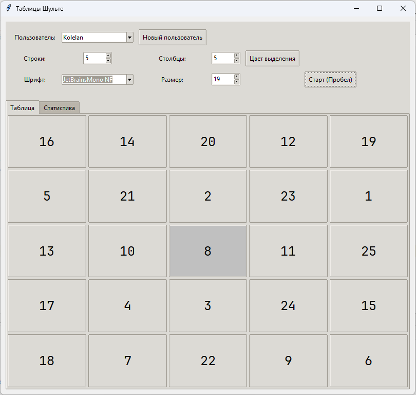

# Таблицы Шульте - Приложение для развития внимания



## Описание

Это приложение генерирует таблицы Шульте - популярный инструмент для тренировки периферического зрения, скорости чтения и концентрации внимания. Программа позволяет настраивать параметры таблиц, сохранять статистику для разных пользователей и анализировать прогресс.

## Основные функции

- Генерация таблиц Шульте с настраиваемыми параметрами:
  - Количество строк (3-10)
  - Количество столбцов (3-10)
  - Выбор шрифта и его размера
  - Настройка цвета выделения центра
  
- Удобное управление:
  - Запуск/остановка сессии кнопкой или пробелом
  - Многопользовательский режим
  
- Подробная статистика:
  - Время выполнения
  - Среднее время на ячейку
  - Графики прогресса
  - История сеансов

## Установка

1. Убедитесь, что у вас установлен Python 3.10 или новее
2. Установите необходимые зависимости:

```bash
pip install matplotlib
```

3. Запустите приложение:

```bash
python main.py
```

## Использование

1. Выберите пользователя или создайте нового
2. Задайте параметры таблицы:
   - Размер (строки × столбцы)
   - Шрифт и его размер
   - Цвет выделения центра
3. Нажмите "Старт" или пробел для начала сеанса
4. Находите числа по порядку, кликая на них
5. По окончании просмотрите статистику во вкладке "Статистика"

## Советы по тренировке

- Старайтесь смотреть в центр таблицы, не двигая глазами
- Используйте периферическое зрение для поиска чисел
- Регулярно тренируйтесь для улучшения результатов
- Начинайте с небольших таблиц (3×3, 4×4), постепенно увеличивая сложность

## Технические требования

- ОС: Windows, macOS или Linux
- Python: версия 3.10+
- Дисковое пространство: 10 МБ (для хранения статистики)

## Лицензия

Это программное обеспечение распространяется по лицензии MIT.

---

Разработано для тренировки внимания и скорочтения. Регулярные занятия помогут улучшить ваши когнитивные способности!
